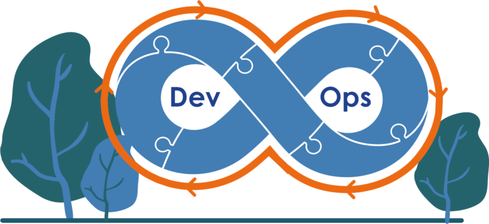

# Welcome to  DevOps-experience!
**some personal DevOps-experience**
This repository that i created for some knowledge sharing that i experienced in production  projects.

this repo consists :
 - [Repository management ](#nexus-repository-management)(Nexus for OS package management & Container Registry)
 - [Zabbix API wrapper](#zabbix-api-wrapper) (Written in Python to retrieve and modify configuration of Zabbix)
 - [Docker tweaks](#docker-tweaks) (log rotate, change IP assignment, custom registries)

---

### Nexus Repository Management
In this scenario we have a docker-compose file that consists two services:
 1. Nginx for proxy
 2. Nexus for repository management
get the file and run `docker-compose -f example.yml up -d`
when two image going to run,  you can login to your repository using your ip address and exposed port, here is : 8081, user name "admin" and password saved somewhere is your container, you can `exec` to the container and `cat` the admin password.

> We have three type of repository in Nexus:
> Proxy,Hosted,Group
>  - Proxy is for proxy every apt packages in repository. it need access to internet for download the requested apt packages and then cache that package in the Nexus data store.
>  - Hosted use case is for some times you have .deb file of your package, u can upload to a Hosted apt repository and then use it.
>  - Group is combination of Proxy and Hosted repository

##### APT repository for Debian based OS
U can create a proxy repository for your Debian based OSs.
Name the apt proxy repository ``apt_proxy``
now edit apt address lines in the ``/etc/apt/sources.list`` file to ``http://proxy-apt.co``
> Don't forget to set "proxy-apt.co"  to localhost in /etc/hosts. because the Nginx in docker-compose file will proxy path your requested address with hostname to the Nexuse service.

and for test just run ``apt update``.
Now all your Debian OSs that sets sources.list to specific address can download packages and they will be cached into the Nexus data store for the next time.

---

### Zabbix API Wrapper
> Under Working!

### Docker Tweaks
-   Log rotation:
    -   Put [this_file](./docker-tweak/docker_log_rotaion) in "/etc/logrotate.d/`docker_log_rotation`"
    -   For force run logrotate, use => `logrotate -f /etc/logrotate.d/docker_log_rotation`
-   Docker Change IP range:
    -   For change ip range of your container, put [daemon.json](./docker-tweak/daemon.json) in `/etc/docker/`
    > Which IP range ? it's depends on u and your infrastructure 
-   Ater all:
    -   `systemctl restart docker`
